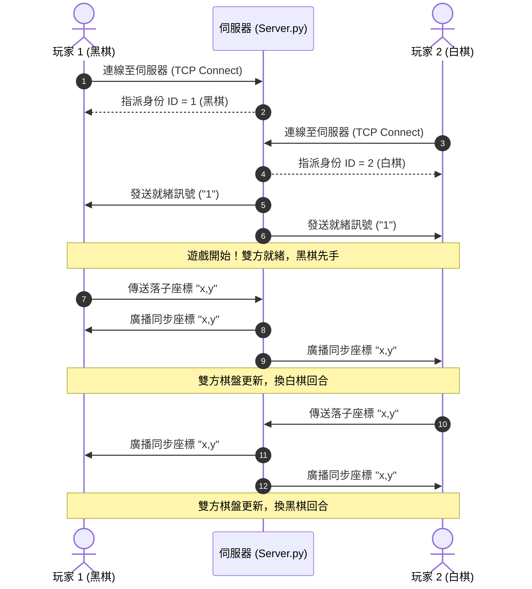

# Gomoku (五子棋) - Pygame 實作教學專案

[](https://www.python.org/)
[](https://www.pygame.org/)
[](#附加教材-網路連線版-架構與原理解析)
[](https://cse.nsysu.edu.tw/)

> **本專案為「2024 國立中山大學資訊工程研習營（中山資工營）」之遊戲實作課程教材。**  
> 營隊課程以 Python 與 Pygame 遊戲引擎為主軸，帶領學員從零打造具備完整圖形化介面、落子音效與四向勝負判定演算法的五子棋遊戲。  
> 專案內亦附有基於 TCP Socket 的「雙人網路連線對戰版」，作為課外附加教材，供對網路程式設計有興趣的學員課後自主鑽研。

---

## 目錄 (Table of Contents)

- [專案特色](#專案特色)
- [專案目錄結構](#專案目錄結構)
- [教學階段 (Course Syllabus)](#教學階段-course-syllabus)
- [核心演算法與數學公式](#核心演算法與數學公式)
- [[附加教材] 網路連線版 架構與原理解析](#附加教材-網路連線版-架構與原理解析)
- [快速開始 (Quick Start)](#快速開始-quick-start)
  - [1. 環境需求與套件安裝](#1-環境需求與套件安裝)
  - [2. 執行單機教學完整版 (正課範例)](#2-執行單機教學完整版-正課範例)
  - [3. 執行 TCP 雙人連線對戰版 (附加教材)](#3-執行-tcp-雙人連線對戰版-附加教材)
- [遊戲操作說明](#遊戲操作說明)

---

## 專案特色

1. **階階段式學習**：
   - 將正課實作拆解為「階段 0」到「階段 4」共五個循序漸進的開發里程碑，降低初學者學習門檻。
2. **學員互動填空教材（Hands-on Practice）**：
   - 提供專屬的 `教學用實作五子棋(填空)` 目錄，學員只需搜尋 `___請填空___`，即可在講師與助教引導下逐步完成遊戲核心程式碼。
3. **物件導向設計（OOP & Pygame Sprite）**：
   - 採用 `pygame.sprite.Sprite` 封裝單顆棋子物件（`Pieces`）。
   - 採用 `pygame.sprite.Group` 管理整個棋盤的二維陣列狀態（`PiecesGroup`）。
4. **即時四方向勝負判定**：
   - 每次落子後自動向「水平、垂直、左上-右下、左下-右上」四個方向探測連續棋子，連成五子即判定獲勝並繪製獲勝連線。
5. **完整聲光回饋**：
   - 內建落子音效（`put.wav`）。
   - 繪製棋盤星位（天元與四角星點）。
   - 前一步（Last move）紅框醒目標記。
   - 雙方持子提示與獲勝公告文字。
6. **課外自主延伸：TCP Socket 網路對戰**：
   - 提供 Client-Server 架構之連線對弈版本，供學員課後延伸探索網路程式設計（非營隊正課講授範圍）。

---

## 專案目錄結構

```text
Gomoku-pygame/
├── 教學/                                # 營隊正課核心教學模組
│   ├── 教學用實作五子棋/                  # [完整解答版] 各階段完整程式碼
│   │   ├── 階段0_建立基礎pygame視窗/     # 建立 Pygame 視窗、主迴圈與事件監聽
│   │   ├── 階段1_繪製棋盤/              # 座標計算、迴圈繪製棋盤線
│   │   ├── 階段2_製作棋子與棋盤物件/     # Sprite 棋子類別、二維陣列、點擊落子
│   │   ├── 階段3_一些細節與輸贏判斷/     # 音效播放、上一手標記、四方向連五判定
│   │   └── 階段4_完成/                  # 星位繪製、勝利連線、結算文字顯示
│   ├── 教學用實作五子棋(填空)/           # [學員練習版] 挖空代碼 (搜尋 ___請填空___)
│   │   ├── 階段0_(填空)建立基礎pygame視窗/
│   │   ├── 階段1_(填空)繪製棋盤/
│   │   ├── 階段2_(填空)製作棋子與棋盤物件/
│   │   ├── 階段3_(填空)一些細節與輸贏判斷/
│   │   └── 階段4_(填空)完成/
│   ├── img/                             # 棋子素材 (Black.png, White.png) 與字型 (font.ttf)
│   └── sound/                           # 音效素材 (put.wav)
│
├── T/                                   # 講師演示版 (Teacher Edition，隨開即用)
│   ├── Game.py                          # 遊戲主程式
│   ├── Pieces.py                        # 棋子與群組邏輯
│   ├── Setting.py                       # 遊戲常數設定 (解析度、顏色、棋盤路數)
│   ├── img/                             # 圖片與字型資源
│   └── sound/                           # 音效資源
│
├── 簡易版/                               # 單機精簡版本 (19 路棋盤，乾淨易讀)
│   ├── Game.py
│   ├── Pieces.py
│   ├── Setting.py
│   └── img/
│
├── 連線版1/                              # [附加教材] TCP 雙人網路連線對戰版
│   ├── Server.py                        # 伺服器端：監聽連線並轉發落子封包
│   ├── Network.py                       # 用戶端連線封裝 (Socket Client)
│   ├── Game.py                          # 用戶端遊戲畫面與連線邏輯
│   ├── GameSetting.py                   # 用戶端設定
│   ├── ServerSetting.py                 # 伺服器設定 (IP、Port、最大連線數)
│   └── img/
│
└── 連線版2 -Reset not complete/         # [附加教材] 連線進階實驗版 (加入按 R 鍵重置對局機制)
    ├── Server.py
    ├── Network.py
    ├── Game.py
    └── ...
```

---

## 教學階段 (Course Syllabus)

營隊正課將五子棋實作拆解為 5 個階段：

| 階段 | 教學主題 | 核心知識點 |
| :--- | :--- | :--- |
| **階段 0** | **建立基礎 Pygame 視窗** | • `pygame.init()` 初始化<br>• `pygame.display.set_mode()` 視窗解析度設定<br>• Game Loop（遊戲主迴圈）概念<br>• `pygame.time.Clock()` 幀率控制（FPS=60）<br>• `pygame.event.get()` 監聽 `QUIT` 離開事件 |
| **階段 1** | **繪製棋盤** | • 視窗幾何學：格線間距 `UNIT_LENGTH = WIN_WIDTH_HEIGHT / (WAY + 1)`<br>• `pygame.draw.line()` 繪製垂直與水平格線<br>• `for` 迴圈在網格繪圖上的應用 |
| **階段 2** | **製作棋子與棋盤物件** | • 物件導向程式設計（OOP）：繼承 `pygame.sprite.Sprite`<br>• 精靈群組 `pygame.sprite.Group` 批量管理<br>• 二維陣列狀態對應（`map[x][y]`：0 空、1 黑、2 白）<br>• 棋子圖片載入與縮放（`convert_alpha()`、`transform.scale()`）<br>• 滑鼠點擊座標換算與邊界合法性檢查 |
| **階段 3** | **細節優化與輸贏判斷** | • 聲音模組：`pygame.mixer.Sound` 播放落子音效<br>• 視覺提示：繪製前一手（Last Move）的紅色邊框<br>• **四方向連五判定演算法**（向左/右、上/下、斜對角掃描計數） |
| **階段 4** | **完成遊戲** | • 棋盤星位（天元與四星點）繪製<br>• 勝利紅線標記（`win_start` 到 `win_end` 劃線）<br>• 自訂字型渲染：`pygame.font.Font` 顯示持子提示與獲勝文字公告 |

> **學習提示**：學員可開啟 `教學用實作五子棋(填空)` 資料夾內的檔案，使用編輯器按下 `Ctrl + F` 搜尋 `___請填空___`，跟著講師與助教的步調動手完成程式碼。

---

## 核心演算法與數學公式

### 1. 棋盤幾何與滑鼠座標轉換
- **格點間距**：
  $$UNIT\_LENGTH = \frac{WIN\_WIDTH\_HEIGHT}{WAY + 1}$$
- **滑鼠像素轉棋盤格點座標 $(x, y)$**：
  $$x = \lfloor \frac{mouse\_x}{UNIT\_LENGTH} - 0.5 \rfloor$$
  $$y = \lfloor \frac{mouse\_y}{UNIT\_LENGTH} - 0.5 \rfloor$$
- **棋盤格點轉視窗繪製像素座標**：
  $$pixel\_x = (x + 1) \times UNIT\_LENGTH$$
  $$pixel\_y = (y + 1) \times UNIT\_LENGTH$$

### 2. 四方向勝負判定演算法
每次落子在 $(x, y)$ 後，以該點為中心，向以下四組方向各向外延伸最多 4 格進行探測：
1. **水平方向**：左向 $(x-i, y)$ 與 右向 $(x+i, y)$
2. **垂直方向**：上向 $(x, y-i)$ 與 下向 $(x, y+i)$
3. **主對角線（左上 ↔ 右下）**：左上 $(x-i, y-i)$ 與 右下 $(x+i, y+i)$
4. **副對角線（左下 ↔ 右上）**：左下 $(x-i, y+i)$ 與 右上 $(x+i, y-i)$

只要任一方向累積之相同連續棋子數（不計自身） $\ge 4$，即判定該玩家達成五連珠獲勝，並記錄連線起點與終點（`win_start`、`win_end`）以繪製勝利連線。

---

## [附加教材] 網路連線版 架構與原理解析

> **說明**：本章節與 `連線版1`、`連線版2` 程式碼屬於**課外附加教材**，營隊正課並未帶到此內容，供對網路通訊協定（Socket Programming）與多人連線有興趣的學員課後自主研究與學習。

`連線版1` 實作了標準的 **Client-Server（用戶端 - 伺服器）** 架構，支援兩名玩家透過 TCP 區域網路進行遠端連線對弈：

### 連線互動流程 (Sequence Diagram)



### 網路通訊關鍵設計：
- **傳輸協定**：使用標準 `socket.AF_INET, socket.SOCK_STREAM`（TCP 保證封包不遺失、不亂序）。
- **非阻塞接收**：Client 端設定 `self.client.settimeout(0.1)`，避免等待對手落子封包時導致 Pygame 畫面卡死。
- **回合鎖定機制**：在 `Game.py` 中嚴格比對 `piecegroup.turn == n.id`，只有輪到自己的回合且雙方皆就緒時才能點擊落子，避免重複或越權落子。

---

## 快速開始 (Quick Start)

### 1. 環境需求與套件安裝

請確認電腦已安裝 **Python 3.8 或以上版本**，並安裝 `pygame` 套件：

```bash
# 安裝 pygame
pip install pygame
```

---

### 2. 執行單機教學完整版 (正課範例)

體驗營隊正課開發完成的單機雙人輪流落子版本：

```bash
# 移動至教學階段 4 目錄
cd "教學/教學用實作五子棋/階段4_完成"

# 啟動遊戲
python Game.py
```

也可以直接進入 `T/` 目錄執行 `python Game.py` 體驗講師展示版。

---

### 3. 執行 TCP 雙人連線對戰版 (附加教材)

連線版支援在同一台電腦開雙視窗測試，或在同一區域網路兩台電腦對戰：

#### 步驟 1：啟動伺服器 (Server)
打開**第 1 個終端機**：
```bash
cd "連線版1"
python Server.py
```
終端機會顯示：`Listening on 127.0.0.1:9487` 並等待玩家連線。

#### 步驟 2：啟動玩家 1 (黑棋)
打開**第 2 個終端機**：
```bash
cd "連線版1"
python Game.py
```
終端機顯示：`Player 1 (...) Ready!`。

#### 步驟 3：啟動玩家 2 (白棋)
打開**第 3 個終端機**：
```bash
cd "連線版1"
python Game.py
```
終端機顯示：`Player 2 (...) Ready!`，雙方視窗即刻同步就緒，開始對弈。

> **跨電腦對戰設定**：若要與其他電腦連線，請開啟 `連線版1/ServerSetting.py` 與 `連線版1/Network.py`，將 `127.0.0.1` 更改為主機電腦在區網內的 IPv4 位址（例如 `192.168.x.x`）。

---

## 遊戲操作說明

| 操作動作 | 功能說明 |
| :--- | :--- |
| **滑鼠左鍵點擊** | 於棋盤交叉點處落子（黑子先手，雙方輪流落子） |
| **紅框提示** | 標記最後一手棋落下的位置，方便辨識最新走勢 |
| **紅色粗線條** | 當某一方五子連線勝利時，自動畫出獲勝的五顆棋子連線 |
| **按鍵 `R`** | *(僅限連線版 2)* 對局結束後按下可重置棋盤開啟新局 |
| **視窗右上角關閉** | 正常退出遊戲並釋放視窗與網路連線資源 |
